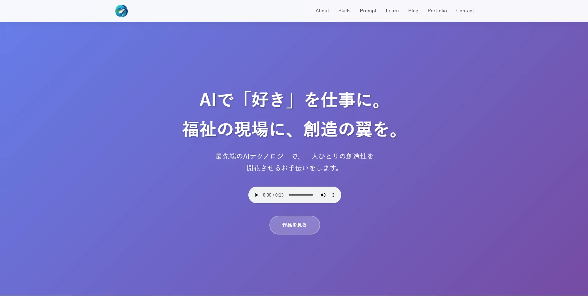

# Chromachannelサイト | 福祉 × AIクリエイター 山本倫久 公式サイト

AIと福祉を繋ぐクリエイター、山本倫久の活動と制作実績、そして私が提供するナレッジを紹介するための公式サイトです。

**▶ サイトをプレビューする**
`https://chromachannel.online/`

## 📖 概要

このサイトは、私、山本倫久の「AIという最先端のテクノロジーを駆使して、福祉の現場に新しい『できる』と『楽しい』を届ける」というミッションを体現するものです。私の持つ多様なスキルセット、具体的な作品群（ポートフォリオ）、そして実践的なノウハウ（プロンプト集など）を、訪問者が直感的に理解できるよう、構造的に設計されています。

## ✨ 主な機能と特徴

*   **マルチページ構成**: サイトの目的別にページを分割 (`index.html`, `portfolio.html`, `prompt.html` など) し、ユーザーが必要な情報にアクセスしやすい構造にしました。
*   **モジュール化されたCSS設計**: サイト全体のデザインを管理する`style.css`、トップページ専用の`topview.css`、「読む」ページ用の`only_read.css`、アプリ用の`only_app.css`にファイルを分割。これにより、高いメンテナンス性と拡張性を実現しました。
*   **レスポンシブデザイン**: PC、タブレット、スマートフォンなど、あらゆるデバイスで最適な表示がされるように設計しています。
*   **インタラクティブなUI**: スクロールに応じたフェードインアニメーションや、モバイル用のハンバーガーメニューを実装し、快適なユーザー体験を提供します。
*   **高機能ポートフォリオ**: カテゴリ別のフィルター機能や、AIイラストの詳細（プロンプトなど）を確認できるモーダルウィンドウ機能を搭載しています。
*   **高度なSEO対策**: 各ページに最適化された`meta`タグ、`canonical`タグ、OGPタグを設定。さらに、構造化データ（JSON-LD）や`sitemap.xml`も活用し、検索エンジンからの評価を高める工夫をしています。

## 💻 使用技術

*   **ライブラリ**: `ress.min.css`, `Tailwind CSS` (一部ページ)

## 📁 ファイル構成
/ (ルートフォルダ)
├── index.html
├── portfolio.html
├── prompt.html
├── learn.html
├── blog.html
├── novels.html
├── privacy.html
├── sitemap.xml
├── README.md
│
├── CSS/
│ ├── style.css # 共通スタイル
│ ├── topview.css # トップページ専用
│ └── only_read.css # 記事・一覧ページ用
│
├── JavaScript/
│ └── script.js # サイト共通スクリプト
│
├── Img/
│ ├── chroma_logo.webp
│ └── ...
│
├── Blog/
├── Novels/
│
└── Portfolio/
├── chirashi/
│ ├── index.html
│ ├── css/
│ │ └── only_app.css
│ └── JavaScript/
│ └── app_script.js
│
├── Demo/
│ ├── lesson_demo.html
│ ├── css/
│ │ └── only_app.css
│ └── JavaScript/
│ └── lesson_script.js
│
└── ... (他のポートフォリオ作品)

## 👤 制作者

*   **氏名**: 山本 倫久 (Norihisa Yamamoto)
*   **役職**: 福祉 × AIクリエイター
*   **住所**: 大阪府大阪市
*   **連絡先**: from.aito.the.infinity@gmail.com