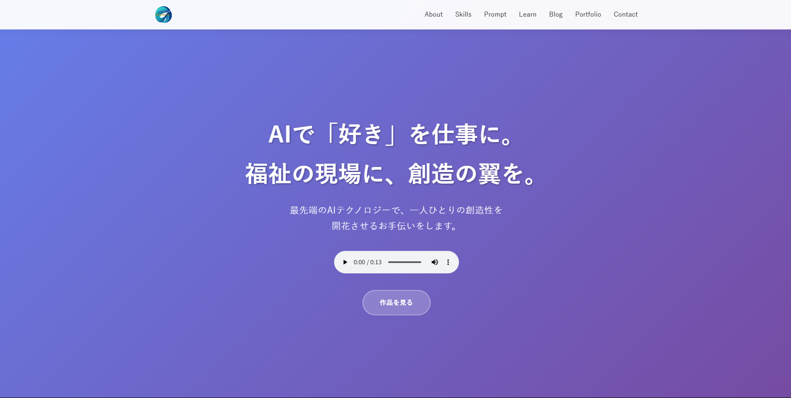

# Chromachannelサイト | AI × 福祉クリエイター 山本倫久 公式サイト

AIと福祉を繋ぐクリエイター、山本倫久氏の活動と制作実績、そして彼が提供するナレッジを紹介するための公式サイトです。

**▶ サイトをプレビューする**
`https://chromachannel.online/`



## 📖 概要

このサイトは、山本倫久氏の「AIという最先端のテクノロジーを駆使して、福祉の現場に新しい『できる』と『楽しい』を届ける」というミッションを体現するものです。彼の持つ多様なスキルセット、具体的な作品群、そして実践的なノウハウ（プロンプト集など）を、訪問者が直感的に理解できるよう、複数の専門ページに分けて構成されています。

## ✨ 主な機能と特徴

*   **マルチページ構成**: サイトの目的別にページを分割 (`index.html`, `portfolio.html`, `prompt.html` など) し、ユーザーが必要な情報にアクセスしやすい構造になっています。
*   **レスポンシブデザイン**: PC、タブレット、スマートフォンなど、あらゆるデバイスで最適な表示がされるように設計されています。
*   **インタラクティブなUI**: スクロールに応じたフェードインアニメーションや、モバイル用のハンバーガーメニューを実装し、快適なユーザー体験を提供します。
*   **ポートフォリオ機能**: カテゴリ別のフィルター機能や、AIイラストの詳細（プロンプトなど）を確認できるモーダルウィンドウ機能を搭載しています。
*   **高度なSEO対策**: 各ページに最適化された`meta`タグ、`canonical`タグ、OGPタグを設定。さらに、構造化データ（JSON-LD）も活用し、検索エンジンからの評価を高める工夫がされています。
*   **コンポーネントの共通化**: ヘッダーやフッターを共通パーツ化し、サイト全体で統一感のあるデザインとナビゲーションを実現しています。

## 💻 使用技術


*   **詳細**: Flexbox, Grid Layout, CSS変数, DOM操作, IntersectionObserver API
*   **ライブラリ**: `ress.min.css`

## 📁 ファイル構成

```
/ (ルートフォルダ)
├── index.html              # トップページ
├── portfolio.html          # 制作実績ページ
├── prompt.html             # プロンプト集トップページ
├── learn.html              # 学習コンテンツページ
├── blog.html               # ブログ一覧ページ
├── sitemap.xml             # サイトマップ
├── README.md               # このファイル
│
├── CSS/
│   └── style.css           # サイト共通のスタイルシート
│
├── JavaScript/
│   └── script.js           # サイト共通のスクリプト
│
├── Img/
│   ├── chroma_logo.webp
│   ├── favicon.png
│   ├── ogp_image.png       # READMEに表示する画像
│   ├── portfolio/          
│   └── blog/               
│
├── Portfolio/              
│   └── Fuwamoco/
│
├── Blog/                   
│   └── A-magic-wand-called-AI.html
│
└── Prompt/                 
    └── prompt-novel-writing.html
```

## 👤 制作者

*   **氏名**: 山本 倫久 (Michihisa Yamamoto)
*   **役職**: AI × 福祉クリエイター
*   **連絡先**: from.aito.the.infinity@gmail.com